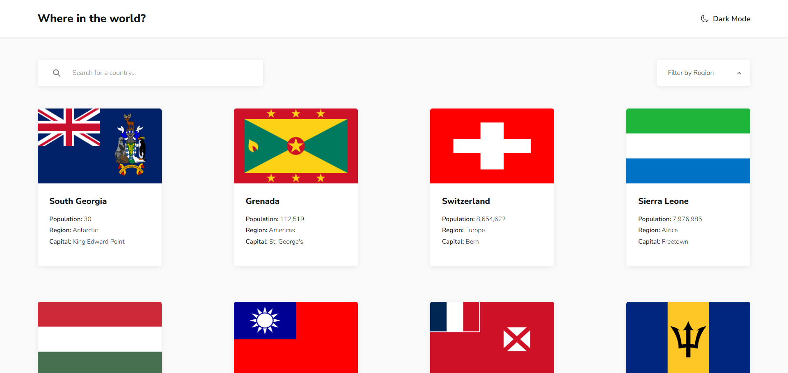

# Frontend Mentor - REST Countries API with color theme switcher solution

This is a solution to the [REST Countries API with color theme switcher challenge on Frontend Mentor](https://www.frontendmentor.io/challenges/rest-countries-api-with-color-theme-switcher-5cacc469fec04111f7b848ca). Frontend Mentor challenges help you improve your coding skills by building realistic projects.

## Table of contents

- [Overview](#overview)
  - [The challenge](#the-challenge)
  - [Screenshot](#screenshot)
  - [Links](#links)
- [Description](#description)
  - [Built with](#built-with)
  - [Features](#features)
- [Author](#author)

## Overview

### The challenge

Users should be able to:

- See all countries from the API on the homepage
- Search for a country using an `input` field
- Filter countries by region
- Click on a country to see more detailed information on a separate page
- Click through to the border countries on the detail page
- Toggle the color scheme between light and dark mode

### Screenshot

### Links

- Solution URL: [\*Click\*](https://www.frontendmentor.io/solutions/responsive-rest-countries-with-themes-infinite-scroll-data-routes-l2c4Q3x4qN)
- Live Site URL: [\*Click\*](https://danil-dikhtyar-rest-countries.netlify.app/)

## Description

### Built with

- Semantic HTML5 markup
- SCSS Modules
- TypeScript
- [React](https://reactjs.org/) - JS library
- [React Router](https://reactrouter.com/) - Routing library
- Suspense API
- Context API
- Intersection Observer API
- Mobile-first workflow

### Features

- Color theme switcher (with local storage support)
- Infinite scroll (for homepage country card list)
- Modern React Router with data routes (for loaders to fetch data with the "render-as-you-fetch" approach)
- Search parameters (for storing searched country and region to make the pages bookmarkable)
- Code splitting (with React.lazy() and Suspense API)

## Author

- Twitter - [@Rock_n_Roll_CRC](https://x.com/Rock_n_Roll_CRC)
- LinkedIn - [@rock-n-roll-crc](https://www.linkedin.com/in/rock-n-roll-crc/)
